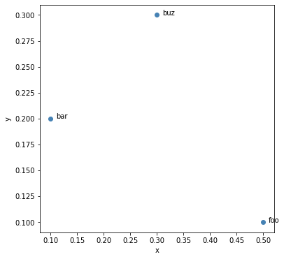
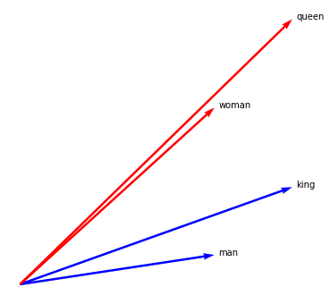
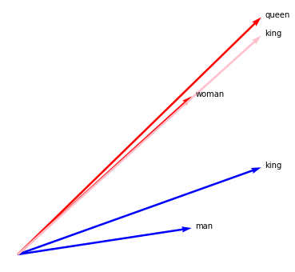
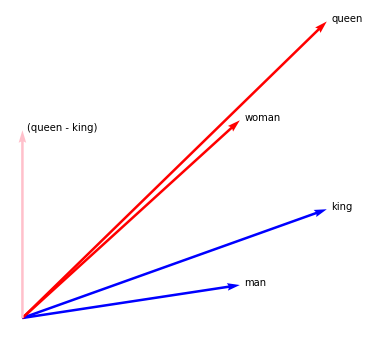
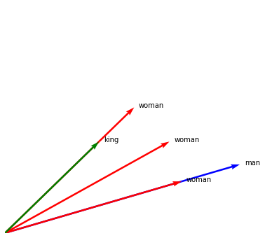
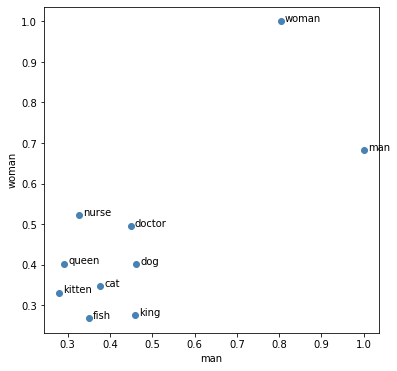
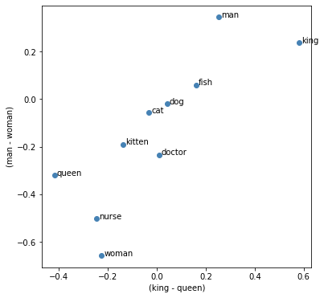

## Imaginary Tokens

Let's make a few word-embeddings. The basic object for this is a `Token` object.

```python 
from whatlies import Embedding

foo = Embedding("foo", [0.5, 0.1]) 
bar = Embedding("bar", [0.1, 0.2])
buz = Embedding("buz", [0.3, 0.3])
```

These are all embedding objects. It has a name and a vector. 
It also has a representation.

```python
foo # Emb[foo]
```

We can also apply operations on it as if it was a vector. 

```python
foo | (bar - buz) # Emb[(foo | (bar - buz))]
```

This will also change the internal vector. 

```python
foo.vector                  # array([ 0.50,  0.10]
(foo | (bar - buz)).vector  # array([ 0.06, -0.12])
```

But why read when we can plot? The whole point of this package is
to make it visual. 

```python
for t in [foo, bar, buz]:
    t.plot(kind="scatter").plot(kind="text");
```



## Meaning

Let's come up with imaginary embeddings for `man`, `woman`, `king` and `queen`. 

We will plot them using the `arrow` plotting type.

```python
man   = Embedding("man", [0.5, 0.1])
woman = Embedding("woman", [0.5, 0.6])
king  = Embedding("king", [0.7, 0.33])
queen = Embedding("queen", [0.7, 0.9])

man.plot(kind="arrow", color="blue")
woman.plot(kind="arrow", color="red")
king.plot(kind="arrow", color="blue")
queen.plot(kind="arrow", color="red")
plt.axis('off');
```



### King - Man + Woman

We can confirm the classic approximation that everybody likes to mention.

```python
man.plot(kind="arrow", color="blue")
woman.plot(kind="arrow", color="red")
king.plot(kind="arrow", color="blue")
queen.plot(kind="arrow", color="red")

(king - man + woman).plot(kind="arrow", color="pink")

plt.axis('off');
```



### King - Queen

But maybe I am interested in the vector that spans between `queen` and `king`. I'll use the `-` operator here to indicate the connection between the two tokens. 

> Notice the poetry there... 

```python
man.plot(kind="arrow", color="blue")
woman.plot(kind="arrow", color="red")
king.plot(kind="arrow", color="blue")
queen.plot(kind="arrow", color="red")
(queen - king).plot(kind="arrow", color="pink", show_ops=True)
plt.axis('off');
```



### Man | (Queen - King)

But that space `queen-king` ... we can also filter all that information out of our words. Linear algebra would call this "making it orthogonal". The `|` operator makes sense here.

```python
man.plot(kind="arrow", color="blue")
woman.plot(kind="arrow", color="red")
king.plot(kind="arrow", color="blue")
queen.plot(kind="arrow", color="red")

(queen - king).plot(kind="arrow", color="pink", show_ops=True)
(man | (queen - king)).plot(kind="arrow", color="pink", show_ops=True)
plt.axis('off');
```


## Embedding Mathmatics

This is interesting. We have our original tokens and can filter away 
the `(man-woman)` axis. By doing this we get "new" embeddings with 
different properties. Numerically we can confirm in our example that 
this new space maps `Emb(man)` to be very similar to `Emb(woman)`.

```python
(man | (queen - king)).vector    # array([0.5, 0. ]
(woman | (queen - king)).vector  # array([0.49999999, 1e-16. ]
```

The same holds for `Emb(queen)` and `Emb(man)`.

```python
(queen | (man - woman)).vector   # array([0.7, 0. ]
(king | (man - woman)).vector    # array([0.7, 0. ]
```

## More Operations 

Let's consider some other operations. For this we will 
make new embeddings. 

```python
man   = Embedding("man", [0.5, 0.15])
woman = Embedding("woman", [0.35, 0.2])
king  = Embedding("king", [0.2, 0.2])

man.plot(kind="arrow", color="blue")
woman.plot(kind="arrow", color="red")
king.plot(kind="arrow", color="green")

plt.xlim(0, 0.5)
plt.ylim(0, 0.5)
plt.axis('off');
```


## Mapping Unto Tokens

In the previous example we demonstrated how to map "away" from vectors. 
But we can also map "unto" vectors. For this we introduce the `>>` operator.

```python
man.plot(kind="arrow", color="blue")
woman.plot(kind="arrow", color="red")
(woman >> man).plot(kind="arrow", color="red")
(woman >> king).plot(kind="arrow", color="red")
king.plot(kind="arrow", color="green")

plt.xlim(0, 0.5)
plt.ylim(0, 0.5)
plt.axis('off');
```



### Measuring the Mapping

Note that the `woman` vector in our embedding maps partially unto `man` and 
overshoots a bit on `king`. We can quantify this by measuring what percentage 
of the vector is covered. This factor can be retreived by using the `>` operator.

```python
woman > king  # 1.3749
woman > man   # 0.7522
```

## Interesting 

This suggests that perhaps ... `king` and `man` can be used as axes for plotting? 

It would also work if the embeddings were in a very high dimensional plane. 

No matter how large the embedding, we could've said `woman` spans 1.375 of 
`king` and 0.752 of `man`. Given `king` as the x-axis and `man` as the y-axis, 
we can map the token of `man` to a 2d representation (1.375, 0.752) 
which is easy to plot.

This is an interesting way of thinking about it. We can plot high 
dimensional vectors in 2d as long as we can plot it along two axes. 
An axis could be a vector of a token, or a token that has had operations on it. 

Note that this `>` mapping can also cause negative values. 

```python
foo = Embedding("foo", [-0.2, -0.2])

foo.plot(kind="arrow", color="pink")
woman.plot(kind="arrow", color="red")
king.plot(kind="arrow", color="green")
(foo >> woman).plot(kind="arrow", color="red", show_ops=True)

plt.xlim(-.3, 0.4)
plt.ylim(-.3, 0.4)
plt.axis('off');
```


```python 
foo > woman # -0.6769
```

## Plotting High Dimensions

Let's confirm this idea by using some spaCy word-vectors.

```python
import spacy 
nlp = spacy.load('en_core_web_md')

words = ["cat", "dog", "fish", "kitten", "man", "woman", "king", "queen", "doctor", "nurse"]
tokens = {t.text: Embedding(t.text, t.vector) for t in nlp.pipe(words)}

x_axis = tokens['man']
y_axis = tokens['woman']
for name, t in tokens.items():
    t.plot(x_axis=x_axis, y_axis=y_axis).plot(kind="text", x_axis=x_axis, y_axis=y_axis)
```



The interesting thing here is that we can also perform operations on these words
before plotting them. 

```python
royalty = tokens['king'] - tokens['queen']
gender = tokens['man'] - tokens['woman']
for n, t in tokens.items():
    (t
      .plot(x_axis=royalty, y_axis=gender)
      .plot(kind="text", x_axis=royalty, y_axis=gender))
```



The idea seems to work. But maybe we can introduce cooler charts and easier ways
to deal with collections of embeddings.