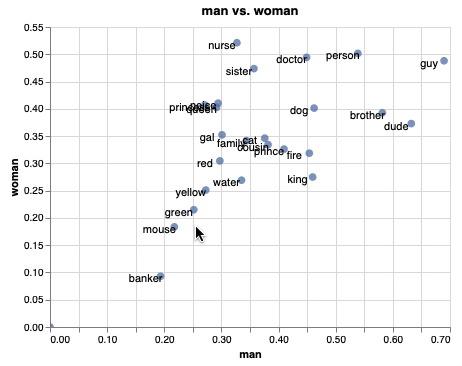
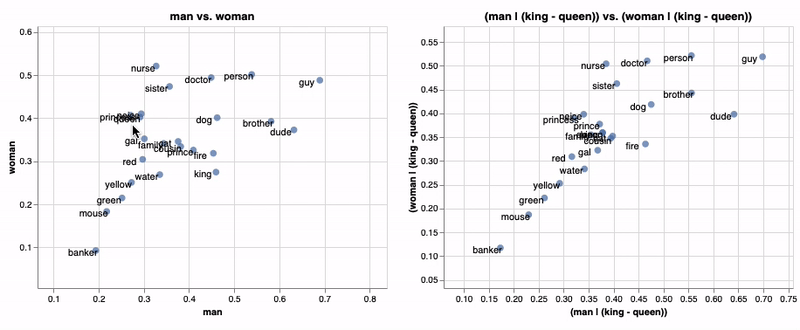
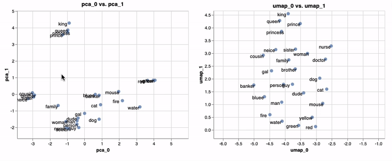

[](https://pepy.tech/project/whatlies)


# whatlies

A library that tries help you to understand (note the pun).

> "What lies in word embeddings?"

This small library offers tools to make visualisation easier of both
word embeddings as well as operations on them. This should be considered
an experimental project that is in preview mode.

Feedback is welcome.


## Produced

This project was initiated at [Rasa](https://rasa.com) as a fun side project
that supports the research and developer advocacy teams at Rasa.
It is maintained by Vincent D. Warmerdam, Research Advocate at Rasa.

## Getting Started

For a quick overview, check out our introductory video on
[youtube](https://www.youtube.com/watch?v=FwkwC7IJWO0&list=PL75e0qA87dlG-za8eLI6t0_Pbxafk-cxb&index=9&t=0s). More
in depth getting started guides can be found on the [documentation page](https://rasahq.github.io/whatlies/).

## Features

The idea is that you can load embeddings from a language backend
and use mathematical operations on it.

```python
from whatlies import EmbeddingSet
from whatlies.language import SpacyLanguage

lang = SpacyLanguage("en_core_web_md")
words = ["cat", "dog", "fish", "kitten", "man", "woman",
         "king", "queen", "doctor", "nurse"]

emb = EmbeddingSet(*[lang[w] for w in words])
emb.plot_interactive(x_axis=emb["man"], y_axis=emb["woman"])
```



You can even do fancy operations. Like projecting unto and away
from vector embeddings! You can perform these on embeddings as
well as sets of embeddings.  In the example below we attempt
to filter away gender bias using linear algebra operations.

```python
orig_chart = emb.plot_interactive('man', 'woman')

new_ts = emb | (emb['king'] - emb['queen'])
new_chart = new_ts.plot_interactive('man', 'woman')
```



There's also things like **pca** and **umap**.

```python
from whatlies.transformers import pca, umap

orig_chart = emb.plot_interactive('man', 'woman')
pca_plot = emb.transform(pca(2)).plot_interactive('pca_0', 'pca_1')
umap_plot = emb.transform(umap(2)).plot_interactive('umap_0', 'umap_1')

pca_plot | umap_plot
```



We even allow for BERT-style embeddings. Just use the square brackets.

```python
lang = SpacyLanguage("en_trf_robertabase_lg")
lang['programming in [python]']
```

You'll now get the embedding for the token "python" but in context of "programming in python".

## Documentation

To learn more and for a getting started guide, check out the [documentation](https://rasahq.github.io/whatlies/).

## Installation

To install the package as well as all the dependencies, simply run;

```bash
pip install whatlies
```

## Similar Projects

There are some projects out there who are working on similar tools and we figured it fair to mention and compare them here.

##### Julia Bazińska & Piotr Migdal Web App

The original inspiration for this project came from [this web app](https://lamyiowce.github.io/word2viz/) and [this pydata talk](https://www.youtube.com/watch?v=AGgCqpouKSs). It is a web app that takes a while to slow
but it is really fun to play with. The goal of this project is to make it
easier to make similar charts from jupyter using different language backends.


##### Tensorflow Projector

From google there's the [tensorflow projector project](https://projector.tensorflow.org/). It offers
highly interactive 3d visualisations as well as some transformations via tensorboard.

- The tensorflow projector will create projections in tensorboard, which you can also load
into jupyter notebook but whatlies makes visualisations directly.
- The tensorflow projector supports interactive 3d visuals, which whatlies currently doesn't.
- Whatlies offers lego bricks that you can chain together to get a visualisation started. This
also means that you're more flexible when it comes to transforming data before visualising it.

##### Parallax

From Uber AI Labs there's [parallax](https://github.com/uber-research/parallax) which is described
in a paper [here](https://arxiv.org/abs/1905.12099). There's a common mindset in the two tools;
the goal is to use arbitrary user defined projections to understand embedding spaces better.
That said, some differences that are worth to mention.

- It relies on bokeh as a visualisation backend and offers a lot of visualisation types
(like radar plots). Whatlies uses altair and tries to stick to simple scatter charts.
Altair can export interactive html/svg but it will not scale as well if you've drawing
many points at the same time.
- Parallax is meant to be run as a stand-alone app from the command line while Whatlies is
meant to be run from the jupyter notebook.
- Parallax gives a full user interface while Whatlies offers lego bricks that you can chain
together to get a visualisation started.
- Whatlies relies on language backends to fetch word embeddings. Parallax allows you to instead
fetch raw files on disk.
- Parallax has been around for a while, Whatlies is more new and therefore more experimental.

## Local Development

If you want to develop locally you can start by running this command.

```bash
make develop
```

### Documentation

This is generated via

```
make docs
```
